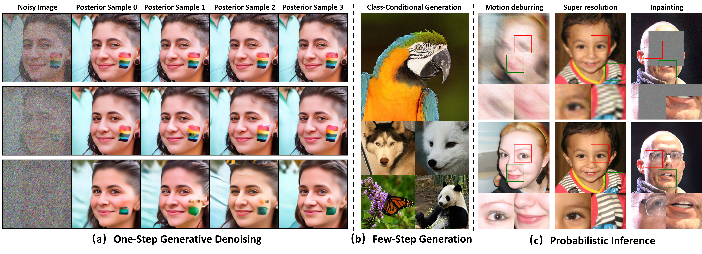

## Noise Conditional Variational Score Distillation &mdash; Official PyTorch Implementation



**Noise Conditional Variational Score Distillation**  
Xinyu Peng, Ziyang Zheng, Yaoming Wang, Han Li, Nuowen Kan, Wenrui Dai, Chenglin Li, Junni Zou, Hongkai Xiong  
https://arxiv.org/abs/2402.02149v2

**Abstract:**  
*We propose Noise Conditional Variational Score Distillation (NCVSD), a novel method for distilling pretrained diffusion models into generative denoisers. We achieve this by revealing that the unconditional score function implicitly characterizes the score function of denoising posterior distributions. By integrating this insight into the Variational Score Distillation (VSD) framework, we enable scalable learning of generative denoisers capable of approximating samples from the denoising posterior distribution across a wide range of noise levels. The proposed generative denoisers exhibit desirable properties that allow fast generation while preserving the benefits of iterative refinement: (1) fast one-step generation through sampling from pure Gaussian noise at high noise levels; (2) improved sample quality by scaling the test-time compute with multi-step sampling; and (3) zero-shot probabilistic inference for flexible and controllable sampling. We evaluate NCVSD through extensive experiments, including class-conditional image generation and inverse problem solving. By scaling the test-time compute, our method outperforms teacher diffusion models and is on par with consistency models of larger sizes. Additionally, with significantly fewer NFEs than diffusion-based methods, we achieve record-breaking LPIPS on inverse problems.*

## Requirements

### Environment
- 64-bit Python 3.9 and PyTorch 2.1 ([PyTorch installation guide](https://pytorch.org))
- Python libraries:  
  ```bash
  pip3 install -r requirements.txt
  ```

### Data
Follow the instructions in [EDM2](https://github.com/NVlabs/edm2?tab=readme-ov-file#preparing-datasets) to prepare the following zip files in the `../data/edm2` folder:
- `img64.zip`
- `img512.zip`
- `img512-sd.zip`

### Teacher EDM2 Models
Download EDM2 models into the `../model_zoo/edm2` folder from the links listed in `quick_start/edm2.txt`.

## Training

Start training by running:
```bash
bash quick_start/train-{MODEL_NAME}.sh
```

The `{MODEL_NAME}` can be one of the following:
 - `img64-{s|m|l}`     
 - `img512-{s|m|l}`
 - `ffhq256-xs`

\* Please modify the `DISTRIBUTED_ARGS` in the scripts according to your training environment.

\* The batch size per GPU (controlled by `--batch-gpu` in the bash scripts) has been optimized for training under NVIDIA A100-80G GPUs. If you run out of GPU memory, please consider modifying `--batch-gpu` to reduce memory cost. Note that, similar to the [EDM2 training](https://github.com/NVlabs/edm2?tab=readme-ov-file#training-new-models), modifying `--batch-gpu` is safe in the sense that it has no interaction with the other hyperparameters.  

## Class-conditional image generation

NCVSD achieves the following image generation performance on ImageNet-64x64 and ImageNet-512x512 datasets:

*Image Generation on ImageNet-64x64:*
| Model | Checkpoint | 1-step FID | 2-step FID | 4-step FID |
| - | - | - | - | - |
NCVSD-S | [img64-s.pkl]() | 3.13 | 2.66 | 2.14 |
NCVSD-M | [img64-m.pkl]() | 3.04 | 2.47 | 1.92 |
NCVSD-L | [img64-l.pkl]() | 2.96 | 2.35 | 1.53 |

*Image Generation on ImageNet-512x512:*
| Model | Checkpoint | 1-step FID | 2-step FID | 4-step FID |
| - | - | - | - | - |
NCVSD-S | [img512-s.pkl]() |2.95 | 2.60 | 2.00 |
NCVSD-M | [img512-m.pkl]() |2.85 | 2.08 | 1.92 |
NCVSD-L | [img512-l.pkl]() |2.56 | 2.03 | 1.76 |

### Generating images

To generate images using provided pkl checkpoints, run `generate_images.py` and specifying
- `--net`, the pkl checkpoint.
- `--ts`, the sampling timesteps, please refer to Table 3 in the paper. * You should add 39 at the last of the timesteps. 
- `--seeds`, random seed.

For example, to generate 4 images using `NCVSD-S` model trained on ImageNet-512x512 dataset with 2 NFEs (sampling timesteps set to 10,22), run

```bash
python generate_images.py \
    --net="/path/to/img512-s.pkl" \
    --ts="10,22,39" \
    --seeds=0-3
```

### Evaluating FID

To reproduce the FID scores, run `calculate_metrics.py` and specifying
- `--net`, the pkl checkpoint.
- `--ts`, the sampling timesteps, please refer to Table 3 in the paper. * You should add 39 at the last of the timesteps.
- `--ref`, pre-computed reference statistics for the dataset.
- `--seed`, random seed, 123456789 by default.

For `--ref`, we use available reference statistics provided in https://nvlabs-fi-cdn.nvidia.com/edm2/dataset-refs:
- Set `--ref="https://nvlabs-fi-cdn.nvidia.com/edm2/dataset-refs/img64.pkl"` for computing FID on ImageNet-64x64 dataset.
- Set `--ref="https://nvlabs-fi-cdn.nvidia.com/edm2/dataset-refs/img512.pkl"` for computing FID on ImageNet-512x512 dataset.

For example, to evaluate 2-step FID of `NCVSD-S` on ImageNet-512x512 dataset, run

```bash
torchrun --standalone --nproc_per_node=8 calculate_metrics.py gen \
    --net="/path/to/img512-s.pkl" \
    --ts="10,22,39" \
    --ref="https://nvlabs-fi-cdn.nvidia.com/edm2/dataset-refs/img512.pkl" \
    --seed=123456789
```

## Inverse problem solving
Solving inverse problems with PnP-GD by running

```bash
bash quick_start/posterior-sample.sh {TASK_NAME}
```

The `{TASK_NAME}` can be one of the following:
- `box_inpainting`
- `gaussian_deblur_circ`
- `motion_deblur_circ`
- `super_resolution`
- `phase_retrieval`

## Citation

## Acknowledgments


